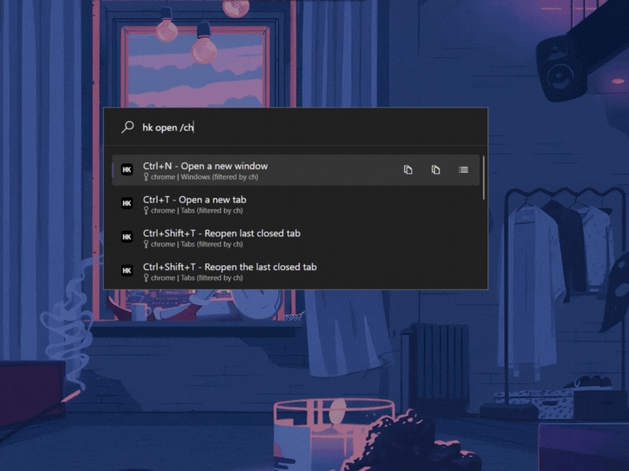
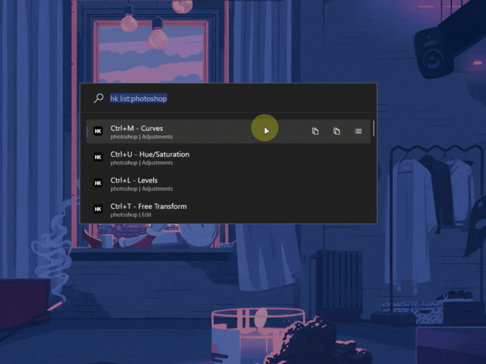
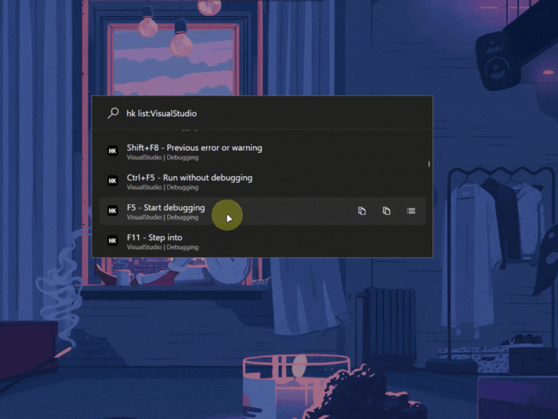
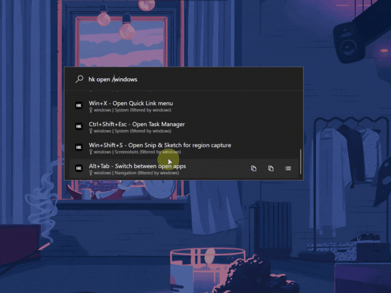

# ⌨️ PowerToys Run: Hotkeys Plugin

<div align="center">
  
</div>

<div align="center">
  <h1>Hotkeys</h1>
  <p>Find and copy keyboard shortcuts for any application directly in PowerToys Run.</p>
  
</div>

<div align="center">
  <!-- Badges -->
  <a href="https://github.com/ruslanlap/PowerToysRun-Hotkeys/actions/workflows/build-and-release.yml">
    
  </a>
  <a href="https://github.com/ruslanlap/PowerToysRun-Hotkeys/releases/latest">
    
  </a>
  
  
  
  
  <a href="https://github.com/ruslanlap/PowerToysRun-Hotkeys/stargazers">
    
  </a>
  <a href="https://github.com/ruslanlap/PowerToysRun-Hotkeys/issues">
    
  </a>
  <a href="https://github.com/ruslanlap/PowerToysRun-Hotkeys/releases/latest">
    
  </a>
  
  
  <a href="https://github.com/ruslanlap/PowerToysRun-Hotkeys/releases/latest">
    
  </a>
  
  
  <a href="https://opensource.org/licenses/MIT">
    
  </a>
</div>

<div align="center">
  <a href="https://github.com/ruslanlap/PowerToysRun-Hotkeys/releases/download/v1.0.1/Hotkeys-1.0.1-x64.zip">
    
  </a>
  <a href="https://github.com/ruslanlap/PowerToysRun-Hotkeys/releases/download/v1.0.1/Hotkeys-1.0.1-arm64.zip">
    
  </a>
</div>


## 📋 Overview

Hotkeys is a powerful plugin for [Microsoft PowerToys Run](https://github.com/microsoft/PowerToys) that lets you instantly find keyboard shortcuts for any application without leaving your keyboard. Simply type `hk <search>` to discover shortcuts from Visual Studio Code, Photoshop, Windows, and hundreds of other applications.

<div align="center">
  
</div>


## 📋 Table of Contents

- [📋 Overview](#-overview)
- [✨ Features](#-features)
- [🎬 Demo](#-demo)
- [🚀 Installation](#-installation)
- [🔧 Usage](#-usage)
- [⚙️ Configuration](#-configuration)
- [📁 Data Structure](#-data-structure)
- [🛠️ Building from Source](#️-building-from-source)
- [📊 Project Structure](#-project-structure)
- [🤝 Contributing](#-contributing)
- [❓ FAQ](#-faq)
- [🧑‍💻 Tech Stack](#-tech-stack)
- [🌐 Localization](#-localization)
- [📸 Screenshots](#-screenshots)
- [📄 License](#-license)
- [🙏 Acknowledgements](#-acknowledgements)
- [☕ Support](#-support)
- [🆕 What's New (v1.2.0)](#-whats-new-v120)

## ✨ Features

- 🔍 **Instant Search**: Find shortcuts by description, key combination, or application name
- 🏷️ **Smart Filtering**: Use `/appname` syntax to filter by specific applications
- 📋 **Quick Copy**: Copy shortcuts or descriptions with keyboard shortcuts
- 🚀 **Blazing Fast**: In-memory caching and optimized search algorithms
- 🎨 **Theme Support**: Auto-adapts to light/dark PowerToys themes
- 🔄 **Live Updates**: Automatically reloads when shortcut files change
- 🏗️ **Extensible**: Add custom shortcuts via JSON files
- 📱 **Multi-Platform**: Support for Windows, Mac, and Linux shortcuts
- ⏱️ **Context Menu**: Rich right-click actions for enhanced workflow
- 💾 **Fuzzy Search**: Find shortcuts even with typos or partial matches
- 🔤 **Multi-Language**: Built-in shortcuts for multiple applications and locales

## 🎬 Demo

<div align="center">
  
  <p><em>Quick hotkey lookup across multiple applications</em></p>

  
  <p><em>Filter by application using /vscode syntax</em></p>

  
  <p><em>Rich context menu with copy and search options</em></p>
</div>

## 📝 Changelog

### v1.0.1 (July 10, 2025)
- Fixed package naming convention to comply with PowerToys Run standards
- Added SHA256 checksums for all release packages
- Removed unnecessary dependencies from the package
- Synchronized version between plugin.json and release artifacts
- Improved GitHub Actions workflow for better release automation

## 🚀 Installation

### Prerequisites

- [PowerToys Run](https://github.com/microsoft/PowerToys/releases) installed (v0.70.0 or later)
- Windows 10 (build 22621) or later
- .NET 7.0 Runtime (included with Windows 11 22H2 or later)

### Quick Install

1. Download the appropriate ZIP for your system architecture:
   - [x64 version](https://github.com/ruslanlap/PowerToysRun-Hotkeys/releases/download/v1.0.1/Hotkeys-1.0.1-x64.zip)
   - [ARM64 version](https://github.com/ruslanlap/PowerToysRun-Hotkeys/releases/download/v1.0.1/Hotkeys-1.0.1-arm64.zip)

2. Extract the ZIP to:
   ```
   %LOCALAPPDATA%\Microsoft\PowerToys\PowerToys Run\Plugins\
   ```
   
   Typical path: `C:\Users\YourUsername\AppData\Local\Microsoft\PowerToys\PowerToys Run\Plugins\`

3. Restart PowerToys (right-click the PowerToys icon in the system tray and select "Restart").

4. Open PowerToys Run (`Alt + Space`) and type `hk <search term>`.

### Manual Verification

To verify the plugin is correctly installed:

1. Open PowerToys Settings
2. Navigate to PowerToys Run > Plugins
3. Look for "Hotkeys" in the list of plugins
4. Ensure it's enabled (toggle should be ON)

## 🔧 Usage

### Basic Commands

1. Activate PowerToys Run (`Alt + Space`).
2. Type:
   - `hk` to see instructions and available commands.
   - `hk <search term>` to find shortcuts by description or keys.
   - `hk /app` or `hk list:app` to filter by application.
   - `hk apps` to list all configured applications.

### Keyboard Shortcuts

- **Enter**: Copy the shortcut key combination to clipboard
- **Ctrl + C**: Copy the description to clipboard
- **Ctrl + Enter**: Open application help page (if available)
- **Right-click**: Show context menu with additional options

### Advanced Search Syntax

| Command              | Description                                    | Example              |
|---------------------|------------------------------------------------|----------------------|
| `hk copy`           | Find all copy-related shortcuts                | Shows Ctrl+C, Cmd+C |
| `hk /vscode`        | Show only Visual Studio Code shortcuts        | Filters to VS Code   |
| `hk list:chrome`    | Alternative app filtering syntax               | Shows Chrome hotkeys |
| `hk apps`           | List all available applications               | Application overview |
| `hk vscode/tab`     | Show VS Code tab-related shortcuts            | Specific category    |

## ⚙️ Configuration

### Plugin Settings (PowerToys Settings → PowerToys Run → Hotkeys)

- **Action Keyword**: Default `hk` (customizable)

### Custom Shortcuts

Create custom shortcut files in:
```
%LOCALAPPDATA%\Microsoft\PowerToys\PowerToys Run\Plugins\Hotkeys\Shortcuts\
```

**Example** (`my-shortcuts.json`):
```json
[
  {
    "shortcut": "Win+Shift+S",
    "description": "Take a screenshot with Snip & Sketch",
    "category": "Windows",
    "source": "Windows",
    "keywords": ["screenshot", "snip", "capture"],
    "platform": "Windows",
    "difficulty": "Beginner"
  },
  {
    "shortcut": "Ctrl+Shift+P",
    "description": "Open command palette",
    "category": "Development",
    "source": "VS Code",
    "keywords": ["command", "palette", "menu"],
    "platform": "Windows",
    "difficulty": "Intermediate"
  }
]
```

## 📁 Data Structure

### Shortcut Schema

Each shortcut follows this JSON structure:

```json
{
  "shortcut": "Ctrl+C",
  "description": "Copy selected text",
  "category": "Editing",
  "source": "Application Name",
  "keywords": ["copy", "clipboard"],
  "platform": "Windows",
  "difficulty": "Beginner",
  "aliases": ["Cmd+C"],
  "version": "1.0",
  "url": "https://app.com/help"
}
```

### Field Definitions

| Field         | Required | Type     | Description                                   |
|---------------|----------|----------|-----------------------------------------------|
| `shortcut`    | ✅ Yes   | string   | The key combination (e.g., `Ctrl+C`)         |
| `description` | ✅ Yes   | string   | What the shortcut does                        |
| `source`      | ✅ Yes   | string   | Application name (e.g., "Visual Studio Code")|
| `category`    | ❌ No    | string   | Grouping (e.g., "Navigation", "Editing")     |
| `keywords`    | ❌ No    | string[] | Search terms for better discoverability      |
| `platform`    | ❌ No    | string   | "Windows", "Mac", "Linux", or "Cross-platform"|
| `difficulty`  | ❌ No    | string   | "Beginner", "Intermediate", "Advanced"       |
| `aliases`     | ❌ No    | string[] | Alternative key combinations                  |
| `version`     | ❌ No    | string   | Application version compatibility             |
| `url`         | ❌ No    | string   | Link to documentation or help page           |

## 🛠️ Building from Source

### Prerequisites

- Visual Studio 2022 or later
- .NET 7.0 SDK
- PowerToys development dependencies

### Build Steps

```bash
git clone https://github.com/ruslanlap/PowerToysRun-Hotkeys.git
cd PowerToysRun-Hotkeys
dotnet restore
dotnet build -c Release
```

### Package for Distribution

```bash
# Build for x64
dotnet publish -c Release -r win-x64 --self-contained false --output ./publish/x64
# Build for ARM64
dotnet publish -c Release -r win-arm64 --self-contained false --output ./publish/arm64

# Create distribution packages
Compress-Archive -Path "./publish/x64/*" -DestinationPath "./Hotkeys-v1.2.0-x64.zip"
Compress-Archive -Path "./publish/arm64/*" -DestinationPath "./Hotkeys-v1.2.0-arm64.zip"
```

### Development Deployment

Use the included PowerShell script for quick development deployment:

```powershell
.\scripts\deploy.ps1
```

## 📊 Project Structure

```
PowerToysRun-Hotkeys/
├── assets/                          # Plugin assets and demos
│   ├── hotkeys.dark.png
│   ├── hotkeys.light.png
│   ├── demo-hotkeys.gif
│   ├── demo-hotkeys2.gif
│   ├── demo-hotkeys3.gif
│   └── demo-hotkeys4.gif
├── src/                            # Plugin source code
│   ├── Community.PowerToys.Run.Plugin.Hotkeys/
│   │   ├── Images/
│   │   │   ├── hotkeys.dark.png
│   │   │   └── hotkeys.light.png
│   │   ├── Shortcuts/              # Built-in shortcut files
│   │   │   ├── vscode.json
│   │   │   ├── windows.json
│   │   │   ├── chrome.json
│   │   │   └── photoshop.json
│   │   ├── Models/
│   │   │   ├── ShortcutModel.cs
│   │   │   └── SearchResult.cs
│   │   ├── Services/
│   │   │   ├── ShortcutService.cs
│   │   │   ├── SearchService.cs
│   │   │   └── IconManager.cs
│   │   ├── Utilities/
│   │   │   ├── FileWatcher.cs
│   │   │   ├── JsonLoader.cs
│   │   │   └── TextHelper.cs
│   │   ├── Main.cs
│   │   └── plugin.json
│   └── Community.PowerToys.Run.Plugin.Hotkeys.csproj
├── tests/                          # Unit tests
│   ├── ShortcutServiceTests.cs
│   ├── SearchServiceTests.cs
│   └── JsonLoaderTests.cs
├── scripts/                        # Build and deployment scripts
│   ├── deploy.ps1
│   ├── build.ps1
│   └── package.ps1
└── README.md
```

## 🤝 Contributing

Contributions are welcome! Here's how you can help:

### Ways to Contribute

1. **Add Application Shortcuts**: Create JSON files for new applications
2. **Improve Search**: Enhance fuzzy search algorithms
3. **Fix Bugs**: Report and fix issues
4. **Documentation**: Improve README and documentation
5. **Localization**: Add support for other languages

### Contributing Process

1. Fork the repository
2. Create a feature branch: `git checkout -b feature/amazing-feature`
3. Commit your changes: `git commit -m 'Add amazing feature'`
4. Push to the branch: `git push origin feature/amazing-feature`
5. Open a Pull Request

### Adding New Application Shortcuts

To add shortcuts for a new application:

1. Create a JSON file in the `Shortcuts/` directory
2. Follow the schema defined in [Data Structure](#-data-structure)
3. Test the shortcuts work correctly
4. Submit a pull request

**Example shortcut file structure:**

```json
[
  {
    "shortcut": "F12",
    "description": "Open Developer Tools",
    "category": "Development",
    "source": "Google Chrome",
    "keywords": ["developer", "tools", "debug", "inspect"],
    "platform": "Cross-platform",
    "difficulty": "Beginner"
  }
]
```

### Contributors

- [ruslanlap](https://github.com/ruslanlap) - Project creator and maintainer
- [Community Contributors](https://github.com/ruslanlap/PowerToysRun-Hotkeys/graphs/contributors) - Thank you!

## ❓ FAQ

<details>
<summary><b>How do I add shortcuts for my favorite application?</b></summary>
<p>Create a JSON file in the Shortcuts directory following our schema. You can also submit it as a pull request to help others!</p>
</details>

<details>
<summary><b>Can I modify existing shortcuts?</b></summary>
<p>Yes! You can create custom JSON files that override built-in shortcuts. Files are loaded in alphabetical order, so later files can override earlier ones.</p>
</details>

<details>
<summary><b>Does the plugin work offline?</b></summary>
<p>Yes! All shortcuts are stored locally and the plugin works completely offline. No internet connection required.</p>
</details>

<details>
<summary><b>How do I change the activation keyword?</b></summary>
<p>Go to PowerToys Settings → PowerToys Run → Plugins → Hotkeys and change the "Action Keyword" field.</p>
</details>

<details>
<summary><b>Can I use keyboard shortcuts to navigate results?</b></summary>
<p>Yes! Use arrow keys to navigate, Enter to copy shortcut, Ctrl+C to copy description, and Ctrl+Enter for help (if available).</p>
</details>

<details>
<summary><b>How does fuzzy search work?</b></summary>
<p>Fuzzy search allows you to find shortcuts even with typos or partial matches. For example, searching "cpoy" will still find "copy" related shortcuts.</p>
</details>

<details>
<summary><b>Can I backup my custom shortcuts?</b></summary>
<p>Yes! Your custom shortcuts are stored in JSON files in the Shortcuts directory. Simply backup that folder to preserve your customizations.</p>
</details>

## 🔆 Feature Spotlight

This section highlights some of the most powerful features of the Hotkeys plugin:

<div align="center">
  <figure>
    
    <figcaption>
      <strong>Smart Application Filtering</strong> - Use `/appname` syntax to instantly filter shortcuts by application. Type `/vscode` to see only Visual Studio Code shortcuts, or `list:chrome` for Chrome-specific hotkeys.
    </figcaption>
  </figure>
  
  <figure>
    
    <figcaption><strong>Rich Context Menu</strong> - Right-click any result to access powerful actions: copy shortcuts, copy descriptions, open help documentation, or search for related shortcuts. Keyboard shortcuts work too!</figcaption>
  </figure>

  <figure>
    
    <figcaption><strong>Intelligent Fuzzy Search</strong> - Find shortcuts even with typos or partial matches. The plugin understands intent and helps you discover shortcuts faster, even when you can't remember the exact terms.</figcaption>
  </figure>
</div>

## 🧑‍💻 Tech Stack

| Technology | Description | Usage |
|---|---|---|
| C# / .NET 7.0 | Primary language and runtime | Core plugin logic |
| PowerToys Run API | IPlugin, IContextMenu, IPluginI18n interfaces | Integration with PowerToys |
| System.Text.Json | JSON parsing and serialization | Loading shortcut files |
| FileSystemWatcher | File monitoring | Live updates for custom shortcuts |
| System.Threading | Asynchronous operations | Non-blocking file operations |
| Fuzzy String Matching | String similarity algorithms | Typo-tolerant search |
| GitHub Actions | CI/CD pipeline | Automated builds and releases |
| MSTest | Unit testing framework | Test coverage and quality |

## 🌐 Localization

Currently, the plugin UI is in English with built-in shortcuts for international applications. Localization support for the interface is planned for future releases.

**Supported Applications Include:**
- Visual Studio Code (global shortcuts)
- Adobe Creative Suite (Photoshop, Illustrator, etc.)
- Microsoft Office Suite
- Web browsers (Chrome, Firefox, Edge)
- Windows system shortcuts
- Development tools (Git, terminal applications)

## 📸 Screenshots

<div style="display:flex;flex-wrap:wrap;justify-content:center;gap:20px;">
  <figure style="margin:0;">
    
    <figcaption style="text-align:center;">Basic Search</figcaption>
  </figure>
  <figure style="margin:0;">
    
    <figcaption style="text-align:center;">App Filtering</figcaption>
  </figure>
  <figure style="margin:0;">
    
    <figcaption style="text-align:center;">Context Menu</figcaption>
  </figure>
  <figure style="margin:0;">
    
    <figcaption style="text-align:center;">Fuzzy Search</figcaption>
  </figure>
  <figure style="margin:0;">
    
    <figcaption style="text-align:center;">Category Browsing</figcaption>
  </figure>
  <figure style="margin:0;">
    
    <figcaption style="text-align:center;">Plugin Settings</figcaption>
  </figure>
</div>

## 📄 License

This project is licensed under the MIT License - see the [LICENSE](LICENSE) file for details.

## 🙏 Acknowledgements

- [Microsoft PowerToys](https://github.com/microsoft/PowerToys) team for the amazing launcher framework
- [Wox](https://github.com/Wox-launcher/Wox) project for inspiring the plugin architecture
- Application vendors who provide comprehensive shortcut documentation
- The open-source community for shortcut data contributions
- All contributors who have helped improve this plugin

## ☕ Support

If you find this plugin useful and would like to support its development, you can buy me a coffee:

[](https://ruslanlap.github.io/ruslanlap_buymeacoffe/)

Your support helps maintain and improve the plugin, add new features, and expand the shortcut database.


<div align="center">
  <sub>Made with ❤️ by <a href="https://github.com/ruslanlap">ruslanlap</a></sub>
</div>